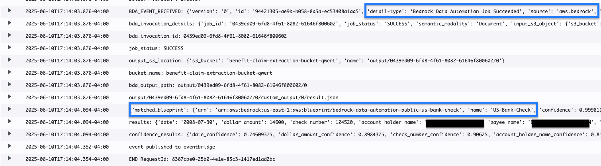

# Amazon Bedrock Data Automation - Benefits Claim Processing

This project demonstrates an automated benefits claim processing system using Amazon Bedrock Data Automation, Amazon Bedrock, Amazon Bedrock Knowledge Base, AWS Lambda, and Amazon DynamoDB  services. The system can process various documents like bank checks and medical receipts, extracting relevant information, validating the benefit claim by applying standard operating procedures and business rules automatically. 

## Architecture Overview


The architecture consists of several key components:

1. **Ingestion Layer**: S3 bucket that receives incoming documents
2. **Extraction Lambda**: Processes new documents using AWS Bedrock Data Automation
3. **Validation Lambda**: Validates the extracted data
4. **Integration Lambda**: Handles the final processing and system integration
5. **DynamoDB**: Stores document processing metadata and status

## BDA Project Configuration

The project uses two custom blueprints for document processing:


### Document Classification Examples

1. US Bank Check Classification:


2. Receipt Classification:


## Project Structure

```
.
├── assets/
│   ├── drawio/             # Architecture diagrams source files
│   ├── images/             # Screenshots and documentation images
│   ├── others/             # Sample Standard Operating procedure for checks and receipts
│   └── results/            # Processing results and samples
├── infrastructure/
│   ├── extraction/          # Document extraction Lambda function
│   ├── integration/         # System integration Lambda function
│   ├── validation/          # Data validation Lambda function
│   ├── samconfig.toml       # SAM CLI configuration
│   └── template.yaml        # AWS SAM template
├── frontend/                # Streamlit frontend application
└── README.md                # Readme file for this code sample
```

## Key Features

1. **Document Processing**
   - Automatic document type classification
   - Text extraction with bounding boxes
   - Support for multiple document types (checks, receipts)

2. **Data Validation**
   - Automated validation of extracted data
   - Error handling and reporting

3. **System Integration**
   - Event-driven architecture using EventBridge
   - DynamoDB for state management
   - S3 for document storage

## Deployment Instructions

1. Build the application:
```bash
cd infrastructure
sam build
```

2. Deploy the application:
```bash
sam deploy --guided --capabilities CAPABILITY_NAMED_IAM
```

3. Run the frontend application
```bash
cd frontend
sam streamlit run app.py
```

## Clean up

To remove all AWS resources deployed through this template:

1. Empty the S3 buckets first (they must be empty to be deleted):
```bash
aws s3 rm s3://benefit-claim-ingestion-bucket-${UniqueKey} --recursive
aws s3 rm s3://benefit-claim-extraction-bucket-${UniqueKey} --recursive
aws s3 rm s3://benefit-claim-kb-bucket-${UniqueKey} --recursive

```

2. Delete the CloudFormation stack:
```bash
sam delete --stack-name <stack-name>
```

This will remove all resources created by the template including:
- S3 buckets (ingestion, extraction and knowledge base bucket)
- Lambda functions (extraction, validation, integration)
- IAM roles and policies
- DynamoDB table
- EventBridge rules
- Bedrock Data Automation project
- OpenSearch Vector Database
- Knowledge Base for Bedrock

## Sample Documents

The project includes sample check and medical receipts for testing. You can use these for getting started but we recommend using your own documents for the testing. 

- Check Samples:
  - sample.png

- Medical Receipt Samples:
  - medical-receipt-1.png
  - medical-receipt-2.png
  - medical-receipt-3.png
  - medical-receipt-4.png

## Security

This sample code is to show art of the possible and relies on the default encryption. For production workloads we recommend using customer-managed KMS keys. Refer this link for creating the KMS keys, https://docs.aws.amazon.com/kms/latest/developerguide/create-keys.html

The project implements secure IAM roles and policies:
- Private S3 buckets with appropriate access controls
- Least privilege IAM roles for Lambda functions
- EventBridge rules with specific targets
- DynamoDB table with Point-in-Time Recovery enabled
- Knowledge Base for Bedrock with least privilege

## License

This library is licensed under the MIT-0 License. See the LICENSE file.